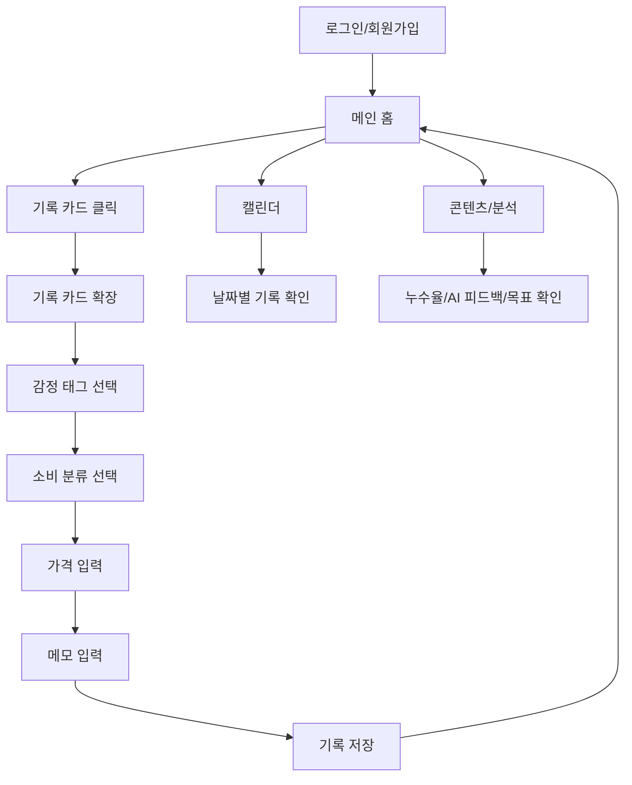
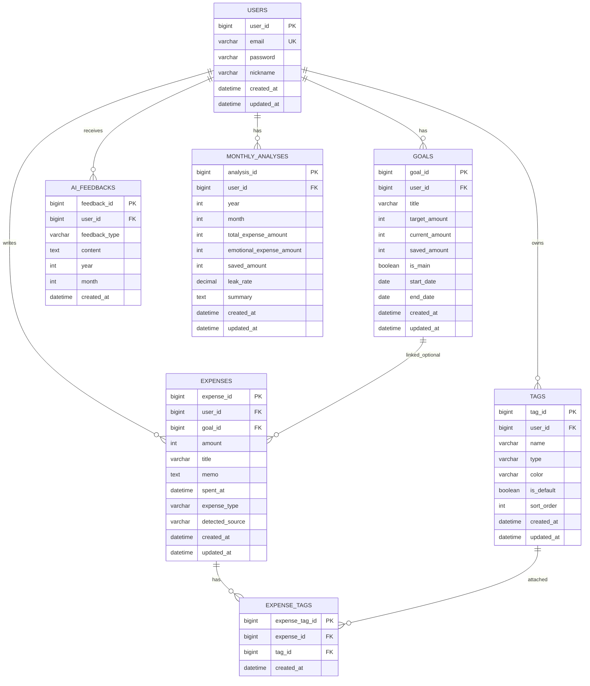

# Feelio 1개월 구현 계획 및 요구사항 정의서

## 0. 문서 목적

본 문서는 **Feelio** 프로젝트를 실제로 1개월 동안 구현하기 위해 필요한 요구사항, 사용자 플로우, ERD, API 명세, 폴더 구조, 구현 스케줄을 하나의 파일로 정리한 문서이다.

Feelio는 사용자가 돈을 쓴 순간의 감정을 태깅하고, AI가 반복되는 감정소비 패턴을 분석하여 **감정 때문에 새는 돈을 줄이고 목표 달성을 돕는 AI 소비 관리 서비스**이다.

---

## 1. 프로젝트 개요

### 1-1. 서비스명

**Feelio**

### 1-2. 서비스 정의

Feelio는 사용자가 소비한 순간의 감정과 상황을 태그로 기록하고, AI가 그 기록을 분석하여 감정소비 패턴, 감정소비 누수율, 목표 달성 상태를 제공하는 서비스이다.

### 1-3. 핵심 컨셉

> 감정을 입력하고, 소비 인사이트를 출력한다.

### 1-4. 핵심 기록 플로우

```text
메인 화면 → 기록 카드 선택 → 감정 태그 → 소비 분류 → 가격 입력 → 메모 입력 → 저장 → 메인 화면 복귀
```

### 1-5. 구현 목표

1개월 동안 구현할 목표는 **웹 MVP**이다.

초기 MVP에서는 카드/계좌 자동 연동이나 MyData 연동 없이 사용자가 직접 기록하는 방식으로 구현한다. 다만 향후 앱 확장 시 Android 알림 기반 소비 감지, MyData, 금융 API 연동이 가능하도록 데이터 구조는 확장성을 고려한다.

---

## 2. MVP 범위

## 2-1. 이번 1개월 안에 반드시 구현할 기능

### 사용자 기능

- 회원가입
- 로그인
- 로그아웃
- JWT 기반 인증
- 내 정보 조회

### 태그 기능

- 기본 감정 태그 제공
- 기본 상황 태그 제공
- 기본 소비 분류 태그 제공
- 사용자별 태그 추가
- 사용자별 태그 수정
- 사용자별 태그 삭제
- 태그 색상 관리
- 태그 타입 구분
  - 감정 태그: EMOTION
  - 상황 태그: SITUATION
  - 소비 분류 태그: CATEGORY

### 소비 기록 기능

- 소비 기록 생성
- 감정 태그 선택
- 소비 분류 선택
- 가격 입력
- 메모 입력
- 소비 일시 저장
- 소비 기록 목록 조회
- 소비 기록 상세 조회
- 소비 기록 수정
- 소비 기록 삭제

### 홈 화면 기능

- 사용자 인사
- 이번 달 감정소비 누수율 표시
- AI 한 줄 피드백 표시
- 최근 기록 표시
- 목표 진행률 카드 표시
- 기록 카드 확장 UI

### 캘린더 기능

- 월별 소비 기록 조회
- 날짜별 대표 감정 표시
- 날짜별 총 소비 금액 표시
- 날짜 클릭 시 해당 날짜 기록 조회

### 목표 기능

- 목표 생성
- 목표 목록 조회
- 대표 목표 설정
- 목표 진행률 조회
- 감정소비를 줄인 금액 반영 구조 설계

### 분석 기능

- 감정소비 누수율 계산
- 감정별 소비 금액 집계
- 소비 분류별 금액 집계
- 시간대별 소비 패턴 집계
- AI 피드백 저장 및 조회

---

## 2-2. 이번 MVP에서 제외할 기능

다음 기능은 1개월 MVP에서는 제외하고, 후순위 확장 기능으로 둔다.

- MyData 연동
- 카드/계좌 자동 연동
- Android 알림 기반 자동 소비 감지
- iOS 위젯/단축어 연동
- 앱 푸시 알림
- 친구와 소비 챌린지
- 평행우주 콘텐츠 고도화
- AI 챗봇형 상담
- 실제 금융기관 API 연동

---

## 3. 핵심 사용자 플로우

## 3-1. 전체 화면 플로우



---

## 3-2. 회원 플로우

```text
서비스 접속
→ 회원가입
→ 로그인
→ JWT 발급
→ 홈 화면 진입
```

### 상세 흐름

1. 사용자가 이메일, 비밀번호, 닉네임을 입력한다.
2. 서버는 이메일 중복 여부를 확인한다.
3. 비밀번호를 암호화하여 저장한다.
4. 회원가입 성공 후 로그인 화면으로 이동한다.
5. 로그인 성공 시 accessToken을 발급한다.
6. 사용자는 인증된 상태로 홈 화면에 접근한다.

---

## 3-3. 기본 기록 플로우

사용자가 가장 자주 사용하는 핵심 플로우이다.

```text
메인 화면
→ "오늘 쓴 돈, 어떤 기분이었어?" 카드 클릭
→ 기록 카드 확장
→ 감정 태그 선택
→ 소비 분류 선택
→ 가격 입력
→ 메모 입력
→ 저장
→ 메인 화면 복귀
```

| 단계 | 화면/동작 | 설명 |
|---|---|---|
| 1 | 메인 화면 | 누수율, AI 피드백, 기록 카드, 목표 카드 표시 |
| 2 | 기록 카드 클릭 | 홈 화면 안에서 카드가 확장됨 |
| 3 | 감정 태그 선택 | 외로움, 신남, 불안, 평온 등 선택 |
| 4 | 소비 분류 선택 | 배달, 카페, 쇼핑, 택시 등 선택 |
| 5 | 가격 입력 | 사용 금액 입력 |
| 6 | 메모 입력 | 짧은 메모 입력 |
| 7 | 저장 | 기록 저장 후 메인 화면 업데이트 |
| 8 | 메인 복귀 | 최근 기록, 누수율, 목표 카드 갱신 |

---

## 3-4. 기록 수정 플로우

```text
캘린더 또는 최근 기록 선택
→ 기록 상세 조회
→ 수정 버튼 클릭
→ 감정/분류/금액/메모 수정
→ 저장
→ 수정된 기록 반영
```

---

## 3-5. 캘린더 조회 플로우

```text
하단 탭 캘린더 클릭
→ 월간 캘린더 조회
→ 날짜별 대표 감정/금액 확인
→ 특정 날짜 클릭
→ 해당 날짜 소비 기록 목록 확인
→ 기록 상세 확인
```

---

## 3-6. 목표 설정 플로우

```text
콘텐츠 또는 홈 목표 카드 클릭
→ 목표 추가
→ 목표명 입력
→ 목표 금액 입력
→ 현재 금액 입력
→ 목표 저장
→ 홈 목표 카드에 반영
```

---

## 3-7. 분석 조회 플로우

```text
하단 탭 콘텐츠 클릭
→ 이번 달 감정소비 누수율 확인
→ 감정별 소비 분석 확인
→ 소비 분류별 분석 확인
→ AI 한 줄 피드백 확인
→ 목표 진행률 확인
```

---

## 4. 요구사항 정의

## 4-1. 기능 요구사항

### FR-001 회원가입

| 항목 | 내용 |
|---|---|
| 설명 | 사용자는 이메일, 비밀번호, 닉네임으로 회원가입할 수 있다. |
| 입력 | email, password, nickname |
| 출력 | 회원가입 성공 메시지 |
| 예외 | 이메일 중복, 비밀번호 형식 오류 |

### FR-002 로그인

| 항목 | 내용 |
|---|---|
| 설명 | 사용자는 이메일과 비밀번호로 로그인할 수 있다. |
| 입력 | email, password |
| 출력 | accessToken |
| 예외 | 이메일 없음, 비밀번호 불일치 |

### FR-003 태그 조회

| 항목 | 내용 |
|---|---|
| 설명 | 사용자는 기본 태그와 자신이 만든 태그를 조회할 수 있다. |
| 입력 | tagType |
| 출력 | 태그 목록 |
| 예외 | 인증 실패 |

### FR-004 태그 생성

| 항목 | 내용 |
|---|---|
| 설명 | 사용자는 감정, 상황, 소비 분류 태그를 직접 추가할 수 있다. |
| 입력 | name, type, color |
| 출력 | 생성된 태그 정보 |
| 예외 | 태그명 중복 |

### FR-005 소비 기록 생성

| 항목 | 내용 |
|---|---|
| 설명 | 사용자는 감정 태그, 소비 분류, 가격, 메모를 입력하여 소비 기록을 생성할 수 있다. |
| 입력 | amount, spentAt, memo, emotionTagId, categoryTagId, situationTagIds |
| 출력 | 생성된 소비 기록 |
| 예외 | 금액 누락, 감정 태그 누락, 소비 분류 누락 |

### FR-006 소비 기록 목록 조회

| 항목 | 내용 |
|---|---|
| 설명 | 사용자는 자신의 소비 기록을 기간별로 조회할 수 있다. |
| 입력 | startDate, endDate |
| 출력 | 소비 기록 목록 |
| 예외 | 인증 실패 |

### FR-007 소비 기록 수정

| 항목 | 내용 |
|---|---|
| 설명 | 사용자는 기존 소비 기록을 수정할 수 있다. |
| 입력 | amount, spentAt, memo, tagIds |
| 출력 | 수정된 소비 기록 |
| 예외 | 기록 없음, 권한 없음 |

### FR-008 소비 기록 삭제

| 항목 | 내용 |
|---|---|
| 설명 | 사용자는 자신의 소비 기록을 삭제할 수 있다. |
| 입력 | expenseId |
| 출력 | 삭제 성공 |
| 예외 | 기록 없음, 권한 없음 |

### FR-009 홈 요약 조회

| 항목 | 내용 |
|---|---|
| 설명 | 사용자는 홈 화면에서 이번 달 누수율, AI 피드백, 최근 기록, 목표 상태를 확인할 수 있다. |
| 입력 | 기준 월 |
| 출력 | homeSummary |
| 예외 | 인증 실패 |

### FR-010 캘린더 조회

| 항목 | 내용 |
|---|---|
| 설명 | 사용자는 월별 소비 기록을 캘린더 형태로 확인할 수 있다. |
| 입력 | year, month |
| 출력 | 날짜별 소비 요약 |
| 예외 | 인증 실패 |

### FR-011 목표 생성

| 항목 | 내용 |
|---|---|
| 설명 | 사용자는 저축/소비 절약 목표를 생성할 수 있다. |
| 입력 | title, targetAmount, currentAmount |
| 출력 | 생성된 목표 |
| 예외 | 목표 금액 오류 |

### FR-012 분석 조회

| 항목 | 내용 |
|---|---|
| 설명 | 사용자는 감정별, 소비 분류별, 시간대별 소비 분석을 확인할 수 있다. |
| 입력 | year, month |
| 출력 | 분석 데이터 |
| 예외 | 인증 실패 |

---

## 4-2. 비기능 요구사항

| 구분 | 요구사항 |
|---|---|
| 보안 | JWT 기반 인증 적용 |
| 보안 | 비밀번호는 BCrypt로 암호화 |
| 보안 | 사용자는 자신의 데이터만 접근 가능 |
| 성능 | 홈 요약 API는 1초 이내 응답 목표 |
| 사용성 | 기록 플로우는 5단계 이내로 완료 가능해야 함 |
| 사용성 | 태그는 칩 형태로 빠르게 선택 가능해야 함 |
| 확장성 | MyData/알림 기반 소비 감지를 나중에 붙일 수 있도록 detectedSource 필드 설계 |
| 유지보수 | 도메인별 패키지 분리 |
| 데이터 | 모든 주요 테이블은 createdAt, updatedAt 보유 |
| 데이터 | 삭제는 초기 MVP에서는 물리 삭제 가능, 확장 시 soft delete 고려 |

---

## 5. 데이터 설계

## 5-1. 주요 엔티티

| 엔티티 | 설명 |
|---|---|
| User | 사용자 정보를 저장한다. |
| Tag | 감정 태그, 상황 태그, 소비 분류 태그를 통합 관리한다. |
| Expense | 사용자의 소비 기록을 저장한다. |
| ExpenseTag | 소비 기록과 태그의 다대다 관계를 저장한다. |
| Goal | 사용자의 목표를 저장한다. |
| AiFeedback | AI가 생성한 한 줄 피드백을 저장한다. |
| MonthlyAnalysis | 월별 분석 결과를 저장한다. |

---

## 5-2. ERD



---

## 5-3. 테이블 상세

## users

| 컬럼 | 타입 | 설명 |
|---|---|---|
| user_id | BIGINT PK | 사용자 ID |
| email | VARCHAR(100) UNIQUE | 이메일 |
| password | VARCHAR(255) | 암호화된 비밀번호 |
| nickname | VARCHAR(50) | 닉네임 |
| created_at | DATETIME | 생성일 |
| updated_at | DATETIME | 수정일 |

## tags

| 컬럼 | 타입 | 설명 |
|---|---|---|
| tag_id | BIGINT PK | 태그 ID |
| user_id | BIGINT NULL | 사용자 ID, 기본 태그는 NULL 가능 |
| name | VARCHAR(50) | 태그명 |
| type | VARCHAR(30) | EMOTION / SITUATION / CATEGORY |
| color | VARCHAR(20) | 태그 색상 |
| is_default | BOOLEAN | 기본 태그 여부 |
| sort_order | INT | 정렬 순서 |
| created_at | DATETIME | 생성일 |
| updated_at | DATETIME | 수정일 |

## expenses

| 컬럼 | 타입 | 설명 |
|---|---|---|
| expense_id | BIGINT PK | 소비 기록 ID |
| user_id | BIGINT FK | 사용자 ID |
| goal_id | BIGINT FK NULL | 연결된 목표 ID |
| amount | INT | 소비 금액 |
| title | VARCHAR(100) | 소비 제목 |
| memo | TEXT | 메모 |
| spent_at | DATETIME | 소비 일시 |
| expense_type | VARCHAR(30) | SPENT / SAVED |
| detected_source | VARCHAR(30) | MANUAL / NOTIFICATION / MYDATA |
| created_at | DATETIME | 생성일 |
| updated_at | DATETIME | 수정일 |

## expense_tags

| 컬럼 | 타입 | 설명 |
|---|---|---|
| expense_tag_id | BIGINT PK | 소비-태그 관계 ID |
| expense_id | BIGINT FK | 소비 기록 ID |
| tag_id | BIGINT FK | 태그 ID |
| created_at | DATETIME | 생성일 |

## goals

| 컬럼 | 타입 | 설명 |
|---|---|---|
| goal_id | BIGINT PK | 목표 ID |
| user_id | BIGINT FK | 사용자 ID |
| title | VARCHAR(100) | 목표명 |
| target_amount | INT | 목표 금액 |
| current_amount | INT | 현재 모은 금액 |
| saved_amount | INT | Feelio를 통해 아낀 금액 |
| is_main | BOOLEAN | 대표 목표 여부 |
| start_date | DATE | 시작일 |
| end_date | DATE | 종료일 |
| created_at | DATETIME | 생성일 |
| updated_at | DATETIME | 수정일 |

## ai_feedbacks

| 컬럼 | 타입 | 설명 |
|---|---|---|
| feedback_id | BIGINT PK | 피드백 ID |
| user_id | BIGINT FK | 사용자 ID |
| feedback_type | VARCHAR(30) | HOME / MONTHLY / WARNING |
| content | TEXT | AI 피드백 내용 |
| year | INT | 기준 연도 |
| month | INT | 기준 월 |
| created_at | DATETIME | 생성일 |

## monthly_analyses

| 컬럼 | 타입 | 설명 |
|---|---|---|
| analysis_id | BIGINT PK | 분석 ID |
| user_id | BIGINT FK | 사용자 ID |
| year | INT | 연도 |
| month | INT | 월 |
| total_expense_amount | INT | 전체 소비 금액 |
| emotional_expense_amount | INT | 감정소비 금액 |
| saved_amount | INT | 참은소비 금액 |
| leak_rate | DECIMAL(5,2) | 감정소비 누수율 |
| summary | TEXT | 분석 요약 |
| created_at | DATETIME | 생성일 |
| updated_at | DATETIME | 수정일 |

---

## 6. API 명세

## 6-1. 공통 응답 형식

```json
{
  "status": 200,
  "message": "success",
  "body": {}
}
```

## 6-2. 에러 응답 형식

```json
{
  "status": 400,
  "message": "잘못된 요청입니다.",
  "body": null
}
```

---

## 6-3. Auth API

### POST /api/auth/signup

회원가입

#### Request

```json
{
  "email": "user@example.com",
  "password": "1234",
  "nickname": "서연"
}
```

#### Response

```json
{
  "status": 200,
  "message": "회원가입 성공",
  "body": {
    "userId": 1,
    "email": "user@example.com",
    "nickname": "서연"
  }
}
```

### POST /api/auth/login

로그인

#### Request

```json
{
  "email": "user@example.com",
  "password": "1234"
}
```

#### Response

```json
{
  "status": 200,
  "message": "로그인 성공",
  "body": {
    "accessToken": "jwt-token",
    "user": {
      "userId": 1,
      "nickname": "서연"
    }
  }
}
```

### GET /api/users/me

내 정보 조회

#### Header

```http
Authorization: Bearer {accessToken}
```

---

## 6-4. Tag API

### GET /api/tags

태그 목록 조회

| Query | 필수 | 설명 |
|---|---|---|
| type | N | EMOTION / SITUATION / CATEGORY |

#### Response

```json
{
  "status": 200,
  "message": "success",
  "body": [
    {
      "tagId": 1,
      "name": "외로움",
      "type": "EMOTION",
      "color": "#5B8DEF",
      "isDefault": true
    }
  ]
}
```

### POST /api/tags

태그 생성

```json
{
  "name": "새벽",
  "type": "SITUATION",
  "color": "#8A6CFF"
}
```

### PUT /api/tags/{tagId}

태그 수정

```json
{
  "name": "새벽소비",
  "color": "#6F7DFF"
}
```

### DELETE /api/tags/{tagId}

태그 삭제

---

## 6-5. Expense API

### POST /api/expenses

소비 기록 생성

#### Request

```json
{
  "title": "배달의민족",
  "amount": 14500,
  "memo": "그냥 허전해서 시킴",
  "spentAt": "2026-06-23T21:40:00",
  "expenseType": "SPENT",
  "detectedSource": "MANUAL",
  "goalId": 1,
  "emotionTagId": 1,
  "categoryTagId": 7,
  "situationTagIds": [11, 12]
}
```

#### Response

```json
{
  "status": 200,
  "message": "소비 기록 생성 성공",
  "body": {
    "expenseId": 1,
    "title": "배달의민족",
    "amount": 14500,
    "memo": "그냥 허전해서 시킴",
    "spentAt": "2026-06-23T21:40:00",
    "expenseType": "SPENT",
    "detectedSource": "MANUAL",
    "tags": [
      { "tagId": 1, "name": "외로움", "type": "EMOTION" },
      { "tagId": 7, "name": "배달", "type": "CATEGORY" },
      { "tagId": 11, "name": "새벽", "type": "SITUATION" }
    ]
  }
}
```

### GET /api/expenses

소비 기록 목록 조회

| Query | 필수 | 설명 |
|---|---|---|
| startDate | N | 시작일 |
| endDate | N | 종료일 |
| year | N | 연도 |
| month | N | 월 |

### GET /api/expenses/{expenseId}

소비 기록 상세 조회

### PUT /api/expenses/{expenseId}

소비 기록 수정

### DELETE /api/expenses/{expenseId}

소비 기록 삭제

---

## 6-6. Home API

### GET /api/home/summary

홈 화면 요약 조회

| Query | 필수 | 설명 |
|---|---|---|
| year | Y | 기준 연도 |
| month | Y | 기준 월 |

#### Response

```json
{
  "status": 200,
  "message": "success",
  "body": {
    "nickname": "서연",
    "leakRate": 38.0,
    "aiFeedback": "넌 외로운 밤마다 배달앱을 켜더라. 이번 주만 4번.",
    "recentExpense": {
      "expenseId": 1,
      "title": "배달의민족",
      "amount": 14500,
      "emotionTagName": "외로움",
      "categoryTagName": "배달"
    },
    "mainGoal": {
      "goalId": 1,
      "title": "내 집 마련",
      "progressRate": 42.0,
      "savedAmount": 62000
    }
  }
}
```

---

## 6-7. Calendar API

### GET /api/calendar

월별 캘린더 조회

| Query | 필수 | 설명 |
|---|---|---|
| year | Y | 연도 |
| month | Y | 월 |

#### Response

```json
{
  "status": 200,
  "message": "success",
  "body": [
    {
      "date": "2026-06-23",
      "totalAmount": 14500,
      "expenseCount": 1,
      "mainEmotion": {
        "tagId": 1,
        "name": "외로움",
        "color": "#5B8DEF"
      }
    }
  ]
}
```

### GET /api/calendar/days/{date}

특정 날짜 기록 조회

---

## 6-8. Goal API

### POST /api/goals

목표 생성

```json
{
  "title": "내 집 마련",
  "targetAmount": 10000000,
  "currentAmount": 4200000,
  "startDate": "2026-06-01",
  "endDate": "2026-12-31",
  "isMain": true
}
```

### GET /api/goals

목표 목록 조회

### PUT /api/goals/{goalId}

목표 수정

### DELETE /api/goals/{goalId}

목표 삭제

---

## 6-9. Analysis API

### GET /api/analysis/monthly

월간 분석 조회

| Query | 필수 | 설명 |
|---|---|---|
| year | Y | 연도 |
| month | Y | 월 |

#### Response

```json
{
  "status": 200,
  "message": "success",
  "body": {
    "year": 2026,
    "month": 6,
    "totalExpenseAmount": 320000,
    "emotionalExpenseAmount": 121600,
    "savedAmount": 62000,
    "leakRate": 38.0,
    "topEmotionTags": [
      {
        "tagName": "외로움",
        "amount": 62000,
        "count": 4
      }
    ],
    "topCategoryTags": [
      {
        "tagName": "배달",
        "amount": 62000,
        "count": 4
      }
    ],
    "aiFeedback": "이번 달은 외로운 밤에 배달 소비가 반복되고 있어."
  }
}
```

### POST /api/ai/feedback

AI 피드백 생성

```json
{
  "year": 2026,
  "month": 6,
  "feedbackType": "HOME"
}
```

---

## 7. 프론트엔드 폴더 구조

React + Vite 기준으로 작성한다.

```text
feelio-front/
├── public/
├── src/
│   ├── apis/
│   │   ├── axiosInstance.js
│   │   ├── authApi.js
│   │   ├── tagApi.js
│   │   ├── expenseApi.js
│   │   ├── goalApi.js
│   │   ├── calendarApi.js
│   │   └── analysisApi.js
│   ├── components/
│   │   ├── common/
│   │   │   ├── BottomNav.jsx
│   │   │   ├── GlassCard.jsx
│   │   │   ├── TagChip.jsx
│   │   │   ├── Button.jsx
│   │   │   └── Modal.jsx
│   │   ├── home/
│   │   │   ├── LeakRateCard.jsx
│   │   │   ├── RecordExpandCard.jsx
│   │   │   ├── RecentExpenseCard.jsx
│   │   │   └── GoalProgressCard.jsx
│   │   ├── calendar/
│   │   │   ├── MonthCalendar.jsx
│   │   │   └── DayExpenseList.jsx
│   │   └── content/
│   │       ├── MonthlyReport.jsx
│   │       ├── EmotionChart.jsx
│   │       └── ParallelUniverseCard.jsx
│   ├── hooks/
│   │   ├── queries/
│   │   │   ├── useHomeSummary.js
│   │   │   ├── useTags.js
│   │   │   ├── useExpenses.js
│   │   │   ├── useCalendar.js
│   │   │   └── useAnalysis.js
│   │   └── mutations/
│   │       ├── useLoginMutation.js
│   │       ├── useExpenseCreateMutation.js
│   │       ├── useTagMutation.js
│   │       └── useGoalMutation.js
│   ├── layouts/
│   │   ├── RootLayout.jsx
│   │   └── MobileLayout.jsx
│   ├── pages/
│   │   ├── LoginPage.jsx
│   │   ├── SignupPage.jsx
│   │   ├── HomePage.jsx
│   │   ├── CalendarPage.jsx
│   │   ├── ContentPage.jsx
│   │   └── GoalPage.jsx
│   ├── routes/
│   │   └── Router.jsx
│   ├── stores/
│   │   ├── authStore.js
│   │   └── recordStore.js
│   ├── styles/
│   │   ├── global.css
│   │   ├── theme.js
│   │   └── glass.css
│   ├── utils/
│   │   ├── dateUtils.js
│   │   ├── moneyUtils.js
│   │   └── tagUtils.js
│   ├── App.jsx
│   └── main.jsx
├── package.json
└── vite.config.js
```

---

## 8. 백엔드 폴더 구조

Spring Boot + MySQL + MyBatis 기준으로 작성한다.

```text
feelio-api/
├── src/main/java/com/feelio/api/
│   ├── FeelioApiApplication.java
│   ├── common/
│   │   ├── response/ApiResp.java
│   │   ├── exception/GlobalExceptionHandler.java
│   │   └── util/DateRangeUtil.java
│   ├── security/
│   │   ├── JwtProvider.java
│   │   ├── JwtAuthenticationFilter.java
│   │   ├── SecurityConfig.java
│   │   └── PrincipalUser.java
│   ├── domain/
│   │   ├── auth/
│   │   │   ├── controller/AuthController.java
│   │   │   ├── service/AuthService.java
│   │   │   └── dto/SignupReq.java
│   │   ├── user/
│   │   │   ├── controller/UserController.java
│   │   │   ├── service/UserService.java
│   │   │   ├── entity/User.java
│   │   │   └── mapper/UserMapper.java
│   │   ├── tag/
│   │   │   ├── controller/TagController.java
│   │   │   ├── service/TagService.java
│   │   │   ├── entity/Tag.java
│   │   │   └── mapper/TagMapper.java
│   │   ├── expense/
│   │   │   ├── controller/ExpenseController.java
│   │   │   ├── service/ExpenseService.java
│   │   │   ├── entity/Expense.java
│   │   │   ├── entity/ExpenseTag.java
│   │   │   └── mapper/ExpenseMapper.java
│   │   ├── goal/
│   │   │   ├── controller/GoalController.java
│   │   │   ├── service/GoalService.java
│   │   │   ├── entity/Goal.java
│   │   │   └── mapper/GoalMapper.java
│   │   ├── calendar/
│   │   │   ├── controller/CalendarController.java
│   │   │   └── service/CalendarService.java
│   │   ├── home/
│   │   │   ├── controller/HomeController.java
│   │   │   └── service/HomeService.java
│   │   └── analysis/
│   │       ├── controller/AnalysisController.java
│   │       ├── service/AnalysisService.java
│   │       ├── service/AiFeedbackService.java
│   │       ├── entity/AiFeedback.java
│   │       ├── entity/MonthlyAnalysis.java
│   │       └── mapper/AnalysisMapper.java
│   └── resources/
│       ├── application.yml
│       └── mappers/
│           ├── UserMapper.xml
│           ├── TagMapper.xml
│           ├── ExpenseMapper.xml
│           ├── GoalMapper.xml
│           └── AnalysisMapper.xml
└── build.gradle
```

---

## 9. 구현 스케줄

## 1주차: 설계 및 기본 세팅

### 목표

프로젝트 구조를 잡고, 인증과 기본 DB를 먼저 완성한다.

| 일차 | 작업 |
|---|---|
| 1일차 | 요구사항 확정, ERD 확정, API 초안 작성 |
| 2일차 | 프론트/백엔드 프로젝트 생성, Git 레포지토리 구성 |
| 3일차 | DB 생성, users/tags/expenses/goals 테이블 생성 |
| 4일차 | 회원가입/로그인/JWT 인증 구현 |
| 5일차 | 기본 태그 seed 데이터 작성 |
| 6일차 | 프론트 라우팅, 로그인/회원가입 화면 구현 |
| 7일차 | 인증 연동 테스트, 1주차 버그 수정 |

### 산출물

- ERD
- DB 스키마
- 백엔드 기본 구조
- 프론트 기본 구조
- 로그인/회원가입 동작

---

## 2주차: 기록 기능 구현

### 목표

Feelio의 핵심인 소비 기록 플로우를 구현한다.

| 일차 | 작업 |
|---|---|
| 8일차 | 태그 API 구현 |
| 9일차 | 태그 조회/생성/수정/삭제 프론트 연동 |
| 10일차 | 소비 기록 생성 API 구현 |
| 11일차 | 소비 기록 수정/삭제/상세 조회 API 구현 |
| 12일차 | 홈 기록 확장 카드 UI 구현 |
| 13일차 | 기록 플로우 연동: 감정 태그 → 분류 → 가격 → 메모 |
| 14일차 | 기록 저장 후 홈 복귀 UX 구현 및 테스트 |

### 산출물

- 태그 CRUD
- 소비 기록 CRUD
- 홈 기록 카드 확장 UI
- 기록 저장 플로우 완성

---

## 3주차: 홈, 캘린더, 목표 기능 구현

### 목표

저장된 기록을 홈, 캘린더, 목표 화면에서 의미 있게 보여준다.

| 일차 | 작업 |
|---|---|
| 15일차 | 홈 요약 API 구현 |
| 16일차 | 홈 화면 누수율/최근 기록/목표 카드 연동 |
| 17일차 | 캘린더 월별 조회 API 구현 |
| 18일차 | 캘린더 화면 UI 및 날짜별 기록 조회 구현 |
| 19일차 | 목표 생성/조회/수정/삭제 API 구현 |
| 20일차 | 목표 진행 카드 프론트 연동 |
| 21일차 | 3주차 통합 테스트 및 버그 수정 |

### 산출물

- 홈 요약 화면
- 캘린더 화면
- 목표 설정 기능
- 목표 진행률 표시

---

## 4주차: 분석, AI 피드백, 마감

### 목표

Feelio의 차별점인 분석과 AI 피드백을 구현하고 프로젝트를 마감한다.

| 일차 | 작업 |
|---|---|
| 22일차 | 감정소비 누수율 계산 로직 구현 |
| 23일차 | 감정별/소비 분류별/시간대별 분석 API 구현 |
| 24일차 | 콘텐츠 화면 분석 리포트 UI 구현 |
| 25일차 | AI 한 줄 피드백 생성 로직 구현 |
| 26일차 | AI 피드백 홈/콘텐츠 화면 연동 |
| 27일차 | 전체 QA, 반응형/모바일 화면 점검 |
| 28일차 | 발표 자료용 시나리오 정리, 최종 버그 수정 |
| 29일차 | 배포 준비 |
| 30일차 | 최종 발표/시연 점검 |

### 산출물

- 감정소비 누수율
- 월간 분석 리포트
- AI 한 줄 피드백
- 최종 시연 가능 버전

---

## 10. 우선순위

## 10-1. 1순위

- 로그인/회원가입
- 태그 조회
- 소비 기록 생성
- 소비 기록 조회
- 홈 기록 카드 확장 UI
- 캘린더 조회

## 10-2. 2순위

- 태그 커스터마이징
- 목표 설정
- 감정소비 누수율
- 콘텐츠 분석 화면

## 10-3. 3순위

- AI 피드백
- 참은소비
- 평행우주 콘텐츠
- 소비 개입 알림

---

## 11. 초기 기본 태그 데이터

## 11-1. 감정 태그

| name | type | color |
|---|---|---|
| 외로움 | EMOTION | #5B8DEF |
| 신남 | EMOTION | #FF7A6B |
| 불안 | EMOTION | #F5A623 |
| 평온 | EMOTION | #2FBFA6 |
| 화남 | EMOTION | #F25555 |
| 무덤덤 | EMOTION | #9AA0B4 |
| 스트레스 | EMOTION | #8A6CFF |
| 뿌듯함 | EMOTION | #F35FA8 |

## 11-2. 소비 분류 태그

| name | type | color |
|---|---|---|
| 배달 | CATEGORY | #5B8DEF |
| 카페 | CATEGORY | #8A6CFF |
| 쇼핑 | CATEGORY | #F35FA8 |
| 택시 | CATEGORY | #F5A623 |
| 편의점 | CATEGORY | #2FBFA6 |
| 간식 | CATEGORY | #FF7A6B |
| 구독 | CATEGORY | #9AA0B4 |

## 11-3. 상황 태그

| name | type | color |
|---|---|---|
| 새벽 | SITUATION | #6F7DFF |
| 혼자있음 | SITUATION | #5B8DEF |
| 퇴근후 | SITUATION | #8A6CFF |
| 충동소비 | SITUATION | #F25555 |
| 보상소비 | SITUATION | #F35FA8 |
| 스트레스받음 | SITUATION | #FF7A6B |
| 월급날 | SITUATION | #2FBFA6 |

---

## 12. 핵심 계산 로직

## 12-1. 감정소비 누수율

감정소비 누수율은 전체 소비 중 감정소비로 분류된 소비가 차지하는 비율이다.

```text
감정소비 누수율 = 감정소비 금액 / 전체 소비 금액 * 100
```

### 감정소비 판단 기준

MVP에서는 다음 태그가 포함된 소비를 감정소비로 판단한다.

- 외로움
- 불안
- 화남
- 스트레스
- 충동소비
- 보상소비
- 새벽

### 예시

```text
전체 소비 금액: 320,000원
감정소비 금액: 121,600원
누수율 = 121,600 / 320,000 * 100 = 38%
```

## 12-2. 목표 진행률

```text
목표 진행률 = 현재 금액 / 목표 금액 * 100
```

## 12-3. 참은소비 반영

참은소비는 실제 지출은 아니지만, 사용자가 소비를 참아 목표에 반영할 수 있는 금액이다.

```text
목표 현재 금액 = 기존 현재 금액 + 참은소비 금액
```

---

## 13. 개발 시 주의사항

## 13-1. 인증/권한

모든 개인 데이터 API는 `@AuthenticationPrincipal` 또는 JWT에서 추출한 userId를 기준으로 조회해야 한다. 프론트에서 넘긴 userId를 신뢰하지 않는다.

## 13-2. 태그 구조

태그는 기본 태그와 사용자 태그를 함께 조회해야 한다.

```sql
WHERE user_id IS NULL OR user_id = #{userId}
```

## 13-3. 소비 기록과 태그

소비 기록 하나에는 여러 태그가 붙을 수 있으므로 `expense_tags` 조인 테이블을 사용한다. 단, 감정 태그와 소비 분류 태그는 프론트에서 필수 선택으로 제한한다.

## 13-4. AI 피드백

MVP에서는 실제 AI API를 붙이기 전에 룰 기반 문장 생성으로 시작해도 된다.

```text
가장 많이 반복된 감정 태그 + 가장 많이 반복된 소비 분류 + 시간대
→ "이번 달은 외로울 때 배달 소비가 자주 나왔어."
```

이후 OpenAI API 또는 다른 LLM API로 확장한다.

## 13-5. Android 알림 감지 확장 대비

MVP에서는 직접 입력만 구현하지만, 향후 앱 확장을 고려하여 `detected_source` 필드를 둔다.

- MANUAL
- NOTIFICATION
- MYDATA

---

## 14. 테스트 체크리스트

## 14-1. 인증

- [ ] 회원가입이 정상 작동하는가?
- [ ] 이메일 중복을 막는가?
- [ ] 로그인 성공 시 토큰이 발급되는가?
- [ ] 토큰이 없으면 보호 API에 접근할 수 없는가?

## 14-2. 태그

- [ ] 기본 태그가 조회되는가?
- [ ] 사용자 태그를 생성할 수 있는가?
- [ ] 태그를 수정할 수 있는가?
- [ ] 태그를 삭제할 수 있는가?
- [ ] 삭제한 태그가 기록에 영향을 주지 않도록 처리했는가?

## 14-3. 소비 기록

- [ ] 소비 기록을 생성할 수 있는가?
- [ ] 감정 태그 없이 저장되지 않는가?
- [ ] 소비 분류 없이 저장되지 않는가?
- [ ] 금액 없이 저장되지 않는가?
- [ ] 기록 수정이 가능한가?
- [ ] 기록 삭제가 가능한가?

## 14-4. 홈

- [ ] 홈 요약 데이터가 표시되는가?
- [ ] 기록 저장 후 최근 기록이 갱신되는가?
- [ ] 누수율이 갱신되는가?
- [ ] 목표 카드가 표시되는가?

## 14-5. 캘린더

- [ ] 월별 기록이 조회되는가?
- [ ] 날짜별 총 금액이 표시되는가?
- [ ] 날짜 클릭 시 상세 기록이 보이는가?

## 14-6. 분석

- [ ] 감정소비 누수율이 계산되는가?
- [ ] 감정별 소비 금액이 집계되는가?
- [ ] 소비 분류별 소비 금액이 집계되는가?
- [ ] AI 피드백 문장이 생성되는가?

---

## 15. 최종 시연 시나리오

1. 사용자가 로그인한다.
2. 홈 화면에서 이번 달 감정소비 누수율 38%를 확인한다.
3. “오늘 쓴 돈, 어떤 기분이었어?” 카드를 클릭한다.
4. 감정 태그로 `외로움`을 선택한다.
5. 소비 분류로 `배달`을 선택한다.
6. 금액 `14,500원`을 입력한다.
7. 메모로 `그냥 허전해서 시킴`을 입력한다.
8. 기록을 저장한다.
9. 홈 화면으로 복귀한다.
10. 최근 기록에 `외로움 · 배달 · 14,500원`이 표시된다.
11. 캘린더에서 해당 날짜에 기록이 표시된다.
12. 콘텐츠 화면에서 `외로움 + 배달` 패턴과 AI 피드백을 확인한다.
13. 목표 카드에서 감정소비를 줄이면 목표에 더 가까워질 수 있다는 메시지를 확인한다.

---

## 16. 프로젝트 완료 기준

1개월 프로젝트 완료 기준은 다음과 같다.

- 사용자가 회원가입/로그인할 수 있다.
- 사용자가 감정 태그와 소비 분류를 선택해 소비 기록을 남길 수 있다.
- 기록된 소비가 홈, 캘린더, 콘텐츠 화면에 반영된다.
- 사용자는 이번 달 감정소비 누수율을 확인할 수 있다.
- 사용자는 목표를 만들고 진행률을 확인할 수 있다.
- 사용자는 AI 또는 룰 기반 한 줄 피드백을 확인할 수 있다.
- 전체 서비스가 모바일 화면 기준으로 시연 가능하다.

---

## 17. 한 줄 정리

> Feelio의 1개월 MVP는 “감정 태그 기반 소비 기록 → 캘린더 확인 → 감정소비 누수율 분석 → 목표 연결”까지 구현하는 것을 목표로 한다.
